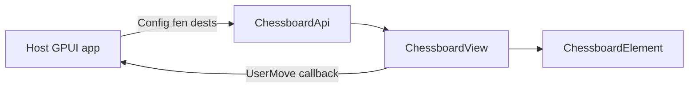
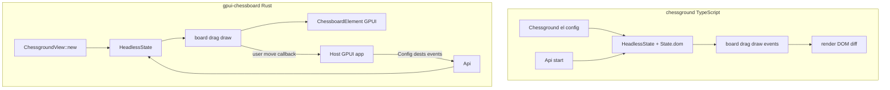

# gpui-chessboard Architecture

**gpui-chessboard** is an embeddable UI library for GPUI desktop applications. It renders chess positions and handles move input — the same role as [lichess-org/chessground](https://github.com/lichess-org/chessground) on the web. It is **not** a standalone chess application.

## Library role

| Responsibility | This crate | Host application |
|----------------|------------|------------------|
| Draw board and pieces | yes | — |
| Animate moves, drag, highlights | yes | — |
| Capture click/drag input | yes | — |
| Chess rules, legality | — | yes |
| Game state, clocks, PGN | — | yes |
| Window, menus, persistence | — | yes |
| Engine / network | — | yes |

The host embeds `ChessboardView` inside its own GPUI layout (analysis panel, game window, puzzle viewer, etc.) and drives the board through `ChessboardApi::set`.

**Layout:** the board fills whatever flex space the host allocates and draws a centered square inside it. If the host chain omits `flex_1` / `min_h_0` / `flex().flex_col()` on wrappers, the board can collapse to zero height. See **[LAYOUT.md](./LAYOUT.md)** for copy-paste patterns (demo, sidebar, tabs).



**Consumption model** (like chessground in a web page):

```toml
# host/Cargo.toml
gpui-chessboard = { path = "../gpui-chessboard" }
```

```rust
// host: create once, embed in layout, update on every position change
let (board, api) = Chessground::new(initial_config, window, cx);

// in host Render:
div().child(board.clone())

// after host validates a move:
api.set(host.to_board_config(), cx);
```

The optional example in `examples/` exists only to exercise the library during development — it is not the product.

```bash
cargo run --example demo
```

## Principles

1. **Library widget, not an app** — public surface is `lib`; no required `main`, no app state in this crate.
2. **UI without chess rules** — the board displays the position and handles input. Legal moves, check, and outcome come from the host via `movable.dests` and `Config`.
3. **Own data formats** — types defined here, no chess crate dependencies. Naming follows chessground and [shakmaty](https://docs.rs/shakmaty) as a reference only.
4. **Headless core + view** — interaction state is GPUI-free; `ChessboardView` is a thin embeddable layer.
5. **Imperative API** — `set`, `move`, `select_square`, `set_shapes`, aligned with chessground `Api`.
6. **One custom Element per board** — not 64 widgets; hit-test, animation, overlays in one place.

## License

This project is licensed under **GPL-3.0-or-later**, aligned with [chessground](../chessground). Porting chessground logic or using its assets (board themes, cburnett pieces) is permitted under the same license. Distributors must provide source code to recipients of binaries or combined works.

## Comparison with chessground



| Layer | chessground | gpui-chessboard |
|-------|-------------|-----------------|
| Entry point | `Chessground(HTMLElement, Config)` | Embed `Entity<ChessboardView>` in host layout; `Chessground::new` + `Api` |
| State | `HeadlessState` / `State` + `dom` | `HeadlessState` + `ViewState { bounds, subscriptions, anim }` |
| Config | `Config`, `configure()` | `Config`, `configure()` — same fields where possible |
| Input | DOM events | GPUI pointer events + `cx.subscribe_in` |
| Rendering | DOM + CSS | `Element::paint` / `prepaint` |
| Teardown | `api.destroy()` | Drop view, unsubscribe `_subscriptions` |

## Crate layout

```
gpui-chessboard/
├── Cargo.toml
├── assets/                    # piece sprites, board themes
├── docs/
│   └── ARCHITECTURE.md
├── .cursor/
│   └── AGENTS.md
└── src/
    ├── lib.rs
    │
    ├── types.rs               # see "Data formats"
    ├── fen.rs                 # piece-placement FEN (like chessground)
    ├── util.rs                # key ↔ square, geometry
    ├── config.rs
    ├── state.rs
    ├── board.rs
    ├── premove.rs
    ├── drag.rs
    ├── draw.rs
    │
    ├── element/
    │   ├── mod.rs
    │   ├── layout.rs
    │   ├── pieces.rs
    │   ├── highlights.rs
    │   ├── shapes.rs
    │   └── anim.rs
    │
    ├── view.rs
    └── api.rs

examples/
    └── demo.rs                # minimal host embedding the widget
```

### Target dependencies

```toml
gpui = { git = "https://github.com/zed-industries/zed", rev = "…" }
# gpui_platform, gpui-component — dev-dependencies for examples/ only
```

The **library** depends only on `gpui`. Host applications use their own `gpui` / `gpui_platform`. Examples under `examples/` use `[dev-dependencies]` for a runnable smoke test.

## Data formats

Types owned by this crate. Names and semantics align with chessground and, where appropriate, shakmaty — so integration with external code is straightforward without a hard dependency.

### Square (`Key` / `Square`)

Two equivalent representations:

```rust
/// Algebraic square name, as in chessground: "a1" … "h8".
/// Special value "a0" — off-board (chessground compatibility).
pub type Key = /* compact string or enum */;

/// Numeric index 0..=63, like shakmaty::Square.
/// file = index % 8 (0 = a), rank = index / 8 (0 = first rank).
#[repr(u8)]
pub enum Square {
    A1 = 0, B1, C1, /* … */ H8 = 63,
}
```

Conversion:

| Key | Square | file | rank |
|-----|--------|------|------|
| `"a1"` | `0` | `0` | `0` |
| `"e4"` | `28` | `4` | `3` |
| `"h8"` | `63` | `7` | `7` |

```rust
pub fn key_to_square(key: Key) -> Option<Square>;
pub fn square_to_key(sq: Square) -> Key;
pub fn square_file(sq: Square) -> u8;  // 0..7 → a..h
pub fn square_rank(sq: Square) -> u8;  // 0..7 → 1..8
```

### Side and piece

```rust
/// Like shakmaty::Color / chessground Color.
#[derive(Clone, Copy, PartialEq, Eq)]
pub enum Color {
    White,
    Black,
}

/// Like shakmaty::Role / chessground Role.
#[derive(Clone, Copy, PartialEq, Eq)]
pub enum Role {
    Pawn,
    Knight,
    Bishop,
    Rook,
    Queen,
    King,
}

/// Like chessground Piece / shakmaty::Piece (role + color + promoted).
#[derive(Clone, Copy, PartialEq, Eq)]
pub struct Piece {
    pub role: Role,
    pub color: Color,
    pub promoted: bool,
}
```

FEN symbols (see below): `P N B R Q K` — white, `p n b r q k` — black.

### Piece placement

```rust
/// Square → piece map. Analog of chessground Pieces / shakmaty board map.
pub type Pieces = HashMap<Key, Piece>;

/// Partial update: None = remove piece from square.
pub type PiecesDiff = HashMap<Key, Option<Piece>>;

/// Legal move targets per chessground: orig → [dest, …].
pub type Dests = HashMap<Key, Vec<Key>>;
```

### FEN (pieces only)

As in chessground: `get_fen()` / `config.fen` contain **only piece placement** — the first field of standard FEN, without castling rights, en passant, or move counters.

```
rnbqkbnr/pppppppp/8/8/8/8/PPPPPPPP/RNBQKBNR
```

Parsing rules (port of `chessground/fen.ts`):

- `/` separates ranks top to bottom (rank 8 → rank 1)
- digit `1`–`8` — consecutive empty squares
- letter — piece; uppercase = white, lowercase = black
- `~` after a letter — promoted (chessground)
- space or `[` — end of piece placement
- `"start"` — initial position

```rust
pub const INITIAL_FEN: &str = "rnbqkbnr/pppppppp/8/8/8/8/PPPPPPPP/RNBQKBNR";

pub fn fen_read(s: &str) -> Pieces;
pub fn fen_write(pieces: &Pieces) -> String;
```

Full FEN (castling, en passant, halfmove, fullmove) is **out of scope** for the board; the host may store it separately and pass only the piece field via `fen` / `set_pieces`.

### User move

The board reports a move as a square pair (like chessground `events.move`):

```rust
/// UI-layer move: from → to. Promotion is separate when needed.
pub struct UserMove {
    pub orig: Key,
    pub dest: Key,
    pub promotion: Option<Role>,
}

pub struct MoveMetadata {
    pub premove: bool,
    pub captured: Option<Piece>,
    // … as in chessground MoveMetadata
}
```

String move format (for host exchange, analogous to shakmaty UCI move, **without** a UCI parser in this crate):

```
<e2><e4>           plain move
<e1><g1>           kingside castle (king destination)
<e7><e8><q>        promotion to queen
```

```rust
/// LAN/UCI-like: "e2e4", "e7e8q". Optional host helper, not required for UI.
pub fn format_move(mv: &UserMove) -> String;
pub fn parse_move(s: &str) -> Result<UserMove, ParseError>;
```

### Display and highlights

```rust
pub struct Config {
    pub fen: Option<String>,
    pub orientation: Color,
    pub turn_color: Color,
    pub check: Option<Key>,           // square of king in check
    pub last_move: Option<[Key; 2]>,
    pub selected: Option<Key>,
    pub movable: MovableConfig,
    // … rest per chessground config.ts
}

pub struct MovableConfig {
    pub free: bool,                   // editor: any move allowed
    pub color: Option<Color>,         // side allowed to move
    pub dests: Option<Dests>,         // from host
    pub show_dests: bool,
    // events.after(orig, dest, metadata)
}
```

### Board overlays (draw shapes)

Port of `chessground/draw.ts`:

```rust
pub struct DrawShape {
    pub orig: Key,
    pub dest: Option<Key>,            // None = circle on orig
    pub brush: Option<BrushColor>,    // green | red | blue | yellow
    pub label: Option<String>,
    // custom_svg, piece overlay, below/above — as needed
}
```

## Headless core

### `board.rs`

- `select_square`, `base_move`, `set_pieces`, `toggle_orientation`
- `can_move` — by `dests` / `movable.free`, **not** by chess rules
- `play_premove`, `play_predrop`, `cancel_move`, `stop`
- Callbacks `events.move`, `movable.events.after` — deferred (like `setTimeout` in chessground)

### `premove.rs` / `drag.rs` / `draw.rs`

Port chessground behavior: pseudo-legal premove by role, drag ghost, arrow drawing.

## GPUI layer

### `ChessboardElement`

```
prepaint  → bounds, hit regions
paint     → squares → highlights → shapes below → pieces → shapes above → ghost
```

### `ChessboardView`

GPUI patterns: `Entity`, `Render`, `cx.subscribe_in`, `cx.notify()`, `cx.spawn` for callbacks.

## Public API

```rust
pub struct Chessground;

impl Chessground {
    pub fn new(
        config: Config,
        window: &mut Window,
        cx: &mut App,
    ) -> (Entity<ChessboardView>, ChessboardApi);
}

impl ChessboardApi {
    pub fn set(&self, config: Config, cx: &mut App);
    pub fn get_fen(&self, cx: &App) -> String;
    pub fn move_(&self, orig: Key, dest: Key, cx: &mut App);
    // …
}
```

Host integration — embed the widget, drive it with `Config`:

```rust
// Host view holds the board entity and api handle.
pub struct GameView {
    board: Entity<ChessboardView>,
    board_api: ChessboardApi,
}

impl GameView {
    fn new(window: &mut Window, cx: &mut App) -> Entity<Self> {
        let config = host_initial_config(); // fen, dests, callbacks
        let (board, board_api) = Chessground::new(config, window, cx);
        cx.new(|_| Self { board, board_api })
    }

    fn on_host_position_changed(&mut self, cx: &mut Context<Self>) {
        self.board_api.set(self.host.to_board_config(), cx);
    }
}

impl Render for GameView {
    fn render(&mut self, _window: &mut Window, cx: &mut Context<Self>) -> impl IntoElement {
        v_flex()
            .size_full()
            .child(self.host.render_toolbar(cx))   // host UI
            .child(
                div()
                    .flex_1()
                    .min_h_0()
                    .flex()
                    .flex_col()
                    .child(self.board.clone()),  // library widget — see docs/LAYOUT.md
            )
            .child(self.host.render_move_list(cx)) // host UI
    }
}
```

Callback wiring (host receives user moves):

```rust
MovableConfig {
    dests: Some(host.legal_dests()),
    events: MovableEvents {
        after: Some(Box::new(|orig, dest, _meta| {
            host.play_move(orig, dest); // host validates, updates state
        })),
    },
    ..Default::default()
}
```

## Examples (`examples/`)

Usage examples live in `examples/` — not in `src/`. Each file is a small host app that embeds the library widget.

```bash
cargo run --example demo
```

```
examples/demo.rs   → minimal host: open window, embed ChessboardView
```

Add new examples as `examples/<name>.rs` (e.g. `embed.rs`, `shapes.rs`). Real applications depend on `gpui-chessboard` as a library and follow the same embed pattern.

## Implementation phases

### Phase summary

| Phase | Focus |
|-------|--------|
| M1 | Data formats, `fen`, `state`, `config`, `board` |
| M2 | Static `ChessboardElement` + `Api` |
| M3 | Click-to-move, highlights, `dests` |
| M4 | Drag, animation |
| M5 | Premove, draw shapes, editor mode |
| M6 | Demo, `format_move`/`parse_move`, polish |

## Out of scope

- Built-in chess rules, legality engine
- Chess engine integration, network protocols
- Full FEN / PGN / clocks
- Web/WASM, 3D board

## Risks and mitigations

| Risk | Mitigation |
|------|------------|
| GPUI pre-1.0 | pin `rev` in `Cargo.toml` |
| Type duplication with host | documented formats + simple converters in examples |
| Promotion on drag | dialog / auto-queen in host or demo |

**Agent guide:** [.cursor/AGENTS.md](../.cursor/AGENTS.md)

## References

- [chessground](../chessground) — UI and API reference
- [GPUI](https://github.com/zed-industries/zed/tree/main/crates/gpui) — desktop UI framework
- [shakmaty types](https://docs.rs/shakmaty/latest/shakmaty/) — naming and format guide (not a dependency)
- [chessground config.ts](https://github.com/lichess-org/chessground/blob/master/src/config.ts)
- [chessground types.ts](https://github.com/lichess-org/chessground/blob/master/src/types.ts)
